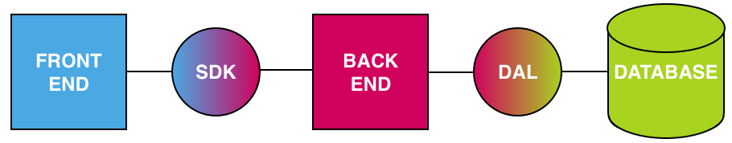

# System Description

## [Back End Server](./backend.server.md)

## [Database](./database.md)

## [Database Library](./db.library.md)

## [Front End Website](./frontend.website.md)

## [Software Development Kit Library](./sdk.library.md)

## [Utility Library](./utility.ibrary.md)

